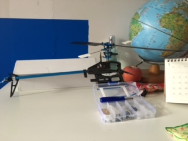

# 得与失

得：
* 受男友的影响，我也爱上无人机了，用天津话说叫倍儿好玩儿。
  
* 学了 python：找回了大学时代写代码的感觉了。
* 能够看国外的技术论文和书籍了，考研还是带给了我许多，即便失败又怎样。
* 向新的领域前进了。是什么，暂时保密..
* 学吉他了，50 分钟 100 RMB，我也是蛮拼的。
* 去水立方游泳了，好贵。到了深水区，我才发现肺活量已大不如前，没事，2016 接着来。
* 爱写 BLOG 了。
* 玩了基金，我的预测能力确实挺好的。。。我都很纳闷。

失：
* 好多书还没有看呢...
* 好多书还没有看呢！
* 好多书还没有看呢。！
* 2016 要是还完不成，我就，我就，我就把头发剪的更短！

